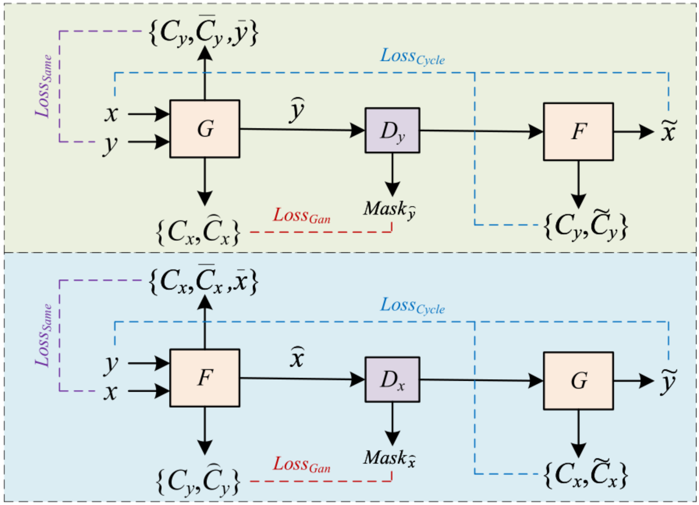
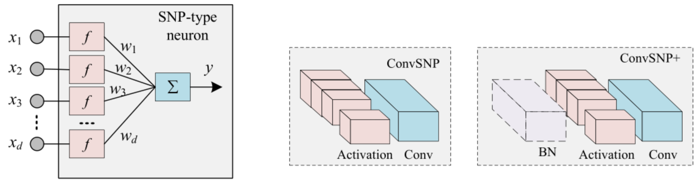
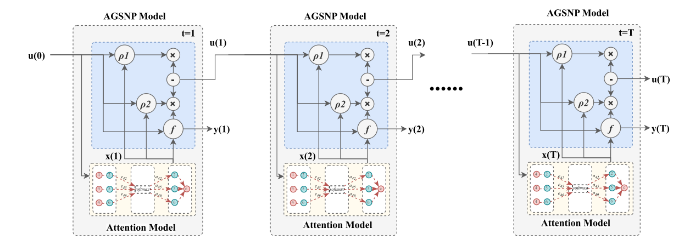

<h1 align="center">Jun Fu (伏俊)</h1>

  <b>Ph.D. Candidate in Cyberspace Security</b> 
  Beijing Electronic Science and Technology Institute (2024–2028)

  
  
  

---

## 🧠 About Me

I am a Ph.D. candidate (2nd year) focusing on **Spiking Neural Networks (SNNs)** and their applications in **Computer Vision** and **Cyberspace Security**.

My research aims to integrate biologically inspired neural dynamics with modern deep learning paradigms to improve **robustness**, **efficiency**, and **interpretability** in visual intelligence systems.

---

## 🔬 Research Interests

- Spiking Neural Networks (SNNs)
- Image Forgery Detection and Localization
- Computer Vision
- Cyberspace Security
- Image Processing

---

## 📚 Publications

### **2026**
- **An Attention-Gated Graph Spiking Neural Membrane System for Structure-Activity Relationship Prediction**  
  *International Journal of Neural Systems (IJNS)*  
  🔗 https://scholar.google.com/citations?view_op=view_citation&hl=zh-CN&user=Y6lnJSgAAAAJ&citation_for_view=Y6lnJSgAAAAJ:d1gkVwhDpl0C  

---

### **2025**
- **LDN-SNP: SNP-based Lightweight Deep Network for CT Image Segmentation of COVID-19**  
  *Expert Systems with Applications (ESWA)*  

---

### **2024**
- **Multitask Adversarial Networks Based on Extensive Nonlinear Spiking Neuron Models**  
  *International Journal of Neural Systems (IJNS)*  
  🔗 https://scholar.google.com/citations?view_op=view_citation&hl=zh-CN&user=Y6lnJSgAAAAJ&citation_for_view=Y6lnJSgAAAAJ:u-x6o8ySG0sC  
---

## 🧪 Selected Research

---

### 🔬 Multitask Adversarial SNN (IJNS 2024)

  

A multitask adversarial learning framework based on **extensive nonlinear spiking neuron models**, integrating:
- Bidirectional mapping with generators (G/F)
- Cycle-consistency constraint
- Mask-guided adversarial optimization

> 🔍 Focus: Robust representation learning via spiking dynamics + adversarial training

---

### 🧠 LDN-SNP: Lightweight SNN (ESWA 2025)

  

A **lightweight deep network** built upon SNP neurons for efficient medical image segmentation.

- SNP-type neuron with nonlinear transformation
- ConvSNP / ConvSNP+ modules
- Designed for **low-computation yet high-performance**

> 🔍 Focus: Efficient spiking-based deep architectures for real-world deployment

---

### ⚡ AGSNP: Attention-Gated Graph SNN (IJNS 2026)

  

An **Attention-Gated Graph Spiking Neural Membrane System** for SAR prediction.

- Temporal dynamics across multiple time steps
- Attention-enhanced spiking neuron computation
- Graph-based molecular representation learning

> 🔍 Focus: Integrating attention + graph learning into spiking neural systems

---
## 🎓 Education

- **Ph.D. in Cyberspace Security**  
  Beijing Electronic Science and Technology Institute  
  *2024 – 2028 (Expected)*  

- **M.Eng. in Electronic Information**  
  Xihua University  
  *2021 – 2024*  

- **B.Eng. in Internet of Things Engineering**  
  Xihua University  
  *2016 – 2020*  

---

## 🚀 Research Focus

- Graph-based Spiking Neural Networks  
- Neural-Symbolic Computing  
- Visual Forensics & Image Manipulation Detection  
- Lightweight Deep Learning Models  

---

## 📊 GitHub Statistics

  
  

---

## 📫 Contact

- 📧 Email: junfu.xhu@foxmail.com  
- 🎓 Google Scholar: https://scholar.google.com/citations?user=Y6lnJSgAAAAJ  
- 🧬 ORCID: https://orcid.org/0009-0004-9599-3718  

---

## ⚡ Academic Vision

> Toward biologically plausible and computationally efficient spiking intelligence for next-generation computer vision systems.
